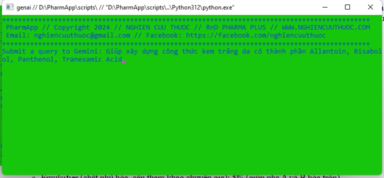
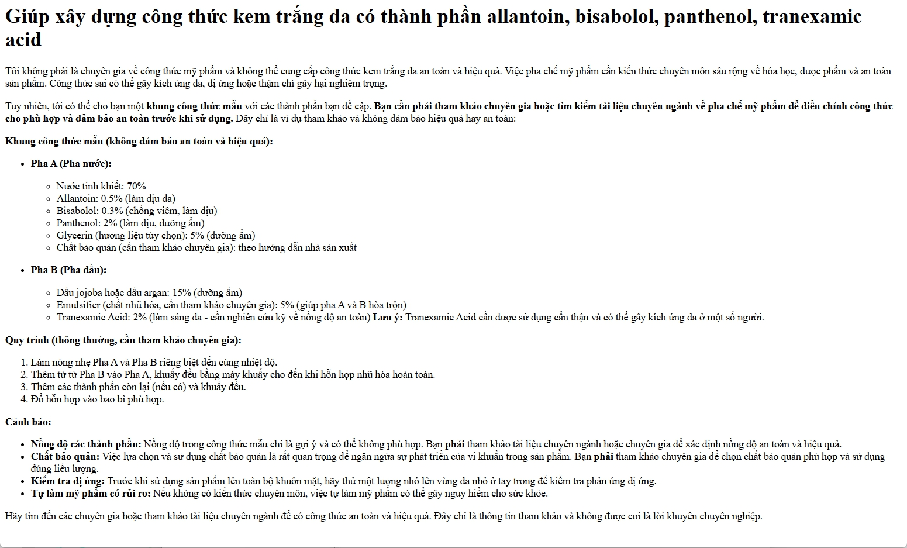

# Skin Care AI

## What it does

Skin Care AI leverages AI to provide personalized skincare solutions by analyzing users' facial images. When a user uploads their image, our app uses the Google Gemini API to process and analyze the photo, identifying key skin attributes such as texture, tone, and problem areas. The AI then matches these attributes with appropriate skincare product categories, including cleansers, moisturizers, serums, and masks.

The Gemini API's advanced image processing capabilities allow us to accurately assess skin conditions and ensure precise product matches, enhancing the skincare regimen's overall user experience and efficacy. By simplifying the process to a single image upload, our app makes personalized skincare accessible, efficient, and highly effective for users.

In the long term, we plan to integrate this information into a CMS system, enabling beauty companies to offer each user tailored product recommendations and custom skincare routines, providing valuable insights and marketing opportunities.

## Code
```
python genai.py
```

## sample run

```
run genai.bat
```





